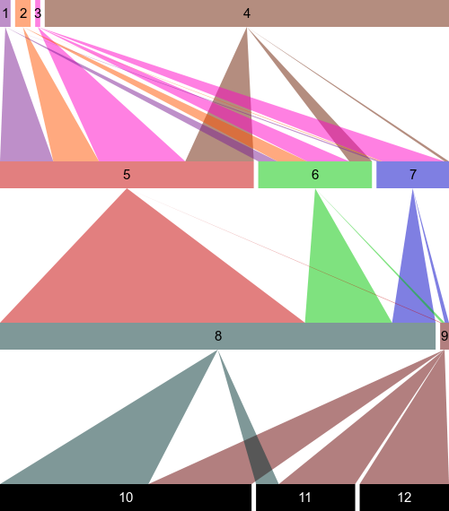

Trophic Network Drawer
======================

This is a JavaScript library to draw trophic networks, under the MIT license.

To draw your own trophic network, you can use the existing `drawTrophic.html` file and
change the trophic levels in it.
You can provide an arbitrary number of trophic levels (minimum is two levels).
For example, the different trophic levels could represent, in the right order, birds,
predatory insects, hyperparasitoids, parasitoids, aphids and host plants.

For each trophic level, you can provide the following information:
- The populations of the different species in percentage (array of numbers between 0 and 1)
- The occupation matrix of the trophic level by the previous trophic level (except for the first
    trophic level): the rows represent the preys (current trophic level) and the columns represent
    the predators (previous trophic level). Each number of the matrix must be a number between 0 and 1.
- The colors to be used for drawing the trophic level. Each color is an object with the properties
    `fill` and `text`: the `fill` color is used for drawing the rectangles and the triangles starting
    from the rectangles; the `text` color is used for drawing the species' labels in their rectangles.
    If there are not enough colors for all the species of the trophic network, it simply goes back to
    the beginning of the array. Each `fill` and `text` color can be a known color
    string (e.g. "black"), a RGB color or even a RGBA color to indroduce
    transparency (e.g. "rgba(126,33,150,0.5)" where the components are red,green,blue,transparency).
- (Optional) The labels to be shown in the species' rectangles. If not set, a unique number will be
    printed in the rectangles.

To be valid, the sum of the populations of a trophic level must be equal to 1, each occupation
matrix must have as many rows as the number of populations in the same trophic level and as many
columns as the number of populations in the previous trophic level and the sum of each row of the
occupation matrices must be equal to 1. The drawer will notify you about the errors in your trophic
levels data when you try to draw a trophic network with invalid input and will let you know
exactly what's wrong.

Also, you can change a few options for the drawer by passing an options object with the following properties:
- separatorWidth: the width separating two rectangles in pixels (default is 5)
- rectangleHeight: the height of the rectangles in pixels (default is 30)
- spaceBetweenLevels: the vertical space between two trophic levels in pixels (default is 150)
- defaultFillColor: the default fill color in case the colors for a trophic level are not set (default is black)
- defaultTextColor:	the default text color in case the colors for a trophic level are not set (default is white)
- canvasWidth: the width of the canvas for the whole trophic network (default is 500)
- font: the font to be used for the species' labels (default is "15px Arial")

You are very welcome to contribute to this project by making issues and/or pull requests.
Especially, a major improvement to be made would be a user interface to enter the trophic
level data in a form or to import it from a file instead of having to write some code.

Here is an example of trophic levels passed to the drawer and the result:

```javascript
var trophicLevels = [
  { // Example: hyperparasitoids
    populations: [0.0236, 0.0448, 0.0212, 0.9104],
    colors: [
      { fill: "rgba(126,33,150,0.5)", text: "black" },
      { fill: "rgba(255,85,0,0.5)", text: "black" },
      { fill: "rgba(255,3,199,0.5)", text: "black" },
      { fill: "rgba(107,28,0,0.5)", text: "black" }
    ]
  },
  { // Example: parasitoids
    populations: [0.5652, 0.2633, 0.1715],
    occupationPerPreviousLevel: [
      [0.21, 0.18, 0.34, 0.27],
      [0.17, 0.26, 0.37, 0.20],
      [0.05, 0.03, 0.86, 0.06]
    ],
    colors: [
      { fill: "rgba(200,0,0,0.5)", text: "black" },
      { fill: "rgba(0,200,0,0.5)", text: "black" },
      { fill: "rgba(0,0,200,0.5)", text: "black" }
    ]
  },
  { // Example: aphids
    populations: [0.9702, 0.0298],
    occupationPerPreviousLevel: [
      [0.70, 0.20, 0.10],
      [0.17, 0.36, 0.47]
    ],
    colors: [
      { fill: "rgba(0,51,51,0.5)", text: "black" },
      { fill: "rgba(102,0,0,0.5)", text: "black" }
    ]
  },
  { // Example: host plants
    populations: [0.5602, 0.2308, 0.2090],
    occupationPerPreviousLevel: [
      [0.59, 0.41],
      [0.23, 0.77],
      [0.0, 1.0]
    ],
    colors: [{ fill: 'black', text: 'white' }]
  }
];

var options = {};

var trophicNetworkDrawer = new TrophicNetworkDrawer();
trophicNetworkDrawer.drawTrophicNetwork(trophicLevels, options);
```


